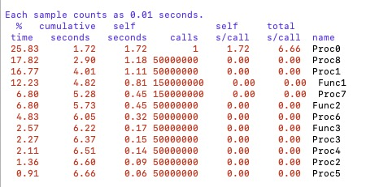
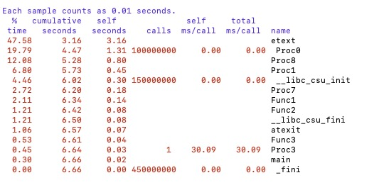
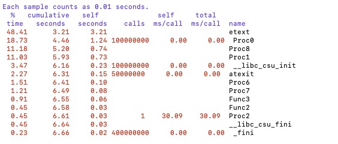
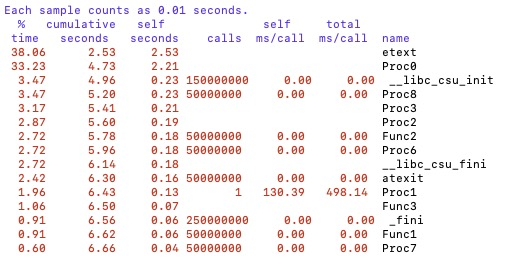
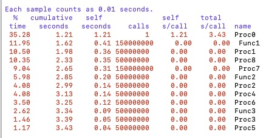
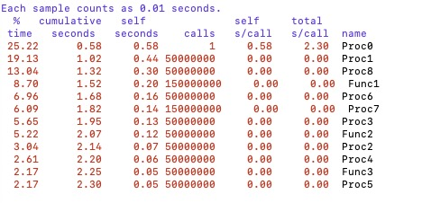
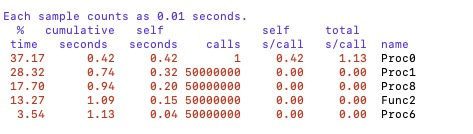
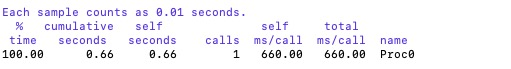

# EECE7352 Homework 1 - Juncen Li 


# Part A


## Question:

You may have to adjust the number of LOOPS specified in the source code to get a reasonable Dhrystone number. Try different numbers of iterations until you get a reasonable result. 

## Answer:

I use X86-64 architecture to evaluate the CPU performance according to changes in the LOOP number. In the beginning, the LOOP = 50000000, then I will change LOOP from 50000000 to 200000000. I will run 12 times.

The CPU information is as follows:

```bash
-bash-4.2$ lscpu
Architecture:          x86_64
CPU op-mode(s):        32-bit, 64-bit
Byte Order:            Little Endian
CPU(s):                24
On-line CPU(s) list:   0-23
Thread(s) per core:    2
Core(s) per socket:    6
Socket(s):             2
NUMA node(s):          2
Vendor ID:             GenuineIntel
CPU family:            6
Model:                 44
Model name:            Intel(R) Xeon(R) CPU           X5650  @ 2.67GHz
Stepping:              2
CPU MHz:               2659.973
BogoMIPS:              5319.94
Virtualization:        VT-x
L1d cache:             32K
L1i cache:             32K
L2 cache:              256K
L3 cache:              12288K
NUMA node0 CPU(s):     0,2,4,6,8,10,12,14,16,18,20,22
NUMA node1 CPU(s):     1,3,5,7,9,11,13,15,17,19,21,23
Flags:                 fpu vme de pse tsc msr pae mce cx8 apic sep mtrr pge mca cmov pat pse36 clflush dts acpi mmx fxsr sse sse2 ss ht tm pbe syscall nx pdpe1gb rdtscp lm constant_tsc arch_perfmon pebs bts rep_good nopl xtopology nonstop_tsc aperfmperf pni pclmulqdq dtes64 monitor ds_cpl vmx smx est tm2 ssse3 cx16 xtpr pdcm pcid dca sse4_1 sse4_2 popcnt aes lahf_lm tpr_shadow vnmi flexpriority ept vpid dtherm ida arat
```

The details of results are as follows: 

```
-bash-4.2$ gcc drystone.c -o drystone
-bash-4.2$ ./drystone 
Dhrystone time for 50000000 passes = 5
This machine benchmarks at 10000000 dhrystones/second
-bash-4.2$ ./drystone 
Dhrystone time for 50000000 passes = 5
This machine benchmarks at 10000000 dhrystones/second
-bash-4.2$ ./drystone 
Dhrystone time for 50000000 passes = 6
This machine benchmarks at 8333333 dhrystones/second
-bash-4.2$ vim drystone.c 
-bash-4.2$ gcc drystone.c -o drystone
-bash-4.2$ ./drystone 
Dhrystone time for 100000000 passes = 11
This machine benchmarks at 9090909 dhrystones/second
-bash-4.2$ ./drystone 
Dhrystone time for 100000000 passes = 10
This machine benchmarks at 10000000 dhrystones/second
-bash-4.2$ ./drystone 
Dhrystone time for 100000000 passes = 10
This machine benchmarks at 10000000 dhrystones/second
-bash-4.2$ vim drystone.c 
-bash-4.2$ gcc drystone.c -o drystone
-bash-4.2$ ./drystone 
Dhrystone time for 150000000 passes = 15
This machine benchmarks at 10000000 dhrystones/second
-bash-4.2$ ./drystone 
Dhrystone time for 150000000 passes = 16
This machine benchmarks at 9375000 dhrystones/second
-bash-4.2$ ./drystone 
Dhrystone time for 150000000 passes = 14
This machine benchmarks at 10714285 dhrystones/second
-bash-4.2$ vim drystone.c 
-bash-4.2$ gcc drystone.c -o drystone
-bash-4.2$ ./drystone 
Dhrystone time for 200000000 passes = 20
This machine benchmarks at 10000000 dhrystones/second
-bash-4.2$ ./drystone 
Dhrystone time for 200000000 passes = 21
This machine benchmarks at 9523809 dhrystones/second
-bash-4.2$ ./drystone 
Dhrystone time for 200000000 passes = 21
This machine benchmarks at 9523809 dhrystones/second
```


Dhrystone Number Table

|Loop       |The average Dhrystone number runs three times|
|-----      |--------     |
|50000000   |  9444444    |
|100000000  |  9696969    |
|150000000  |  10029761   |
|200000000  |  9682539    |


So, the reasonable Dhrystone numbe equals (9444444 + 9696969 + 10029761 + 9682539) / 4 = 9,713,428


## Question:

Also, make multiple runs of Dhrystone to guarantee you have factored out any sampling or cold-start effects. Make sure to discussion this issue in your paper and report on the error in your measurements.

## Answer:

Sampling and cold-start effects can impact the results of the Dhrystone benchmark and introduce error in the measurements because they can cause variations in the performance of the system being tested.

In terms of sampling effects, different input data can result in variations in the performance of the system. For example, if the benchmark is run with a dataset that is particularly large or complex, the results may be different than if the benchmark is run with a smaller or simpler dataset. These variations in the input data can affect the performance of the system and lead to errors in the measurements.

Cold-start effects can also impact the results of the benchmark because the initial state of the system can affect its performance. For example, when the system is first powered on, it may not be fully initialized, and its performance may be affected. This can lead to variations in the results if the benchmark is run immediately after the system is powered on, versus if it is run after the system has been running for a period of time. These variations can affect the accuracy of the measurements and introduce error.

By taking into account the effects of sampling and cold-start, it is possible to run the benchmark multiple times with different input data and allow the system to warm up before each run. These steps can help to reduce the impact of these effects on the results and improve the accuracy of the measurements.


## Question:

Run Dhrystone compiled with and without optimization (find out how to use the compiler switches, the man gcc pages should help). Explain the results you are getting. How does optimization affect the results obtained on the different architectures and why? 


## Answer:

|Optimization       |The average Dhrystone number runs three times|
|-----              |--------     |
|No  Optimization   |  9444444    |
|-O1                |  41666666   |
|-O2                |  41666666   |
|-O3                |  50000000   |

As we use -OX (from 1 to 3), the performance is improving. 

When using the GCC -O switch, where X is a value between 1 and 3, the compiler is applying different levels of optimization to the code. The higher the value of X, the more aggressive the optimizations applied.

When using the -O switch, the compiler will perform a series of transformations on the source code to make it more efficient. These optimizations can include things like removing unnecessary instructions, reducing the number of memory accesses, and reordering instructions to improve the performance of the CPU.

At -O1, the compiler performs basic optimizations that improve the performance of the code without sacrificing the readability of the code.

At -O2, the compiler performs more aggressive optimization that can improve the performance of the code, but it may make the code harder to understand.

At -O3, the compiler performs even more aggressive optimization that can improve the performance of the code, but it may make the code harder to understand.

When applied to the Dhrystone benchmark, these optimizations can increase the Dhrystone number. This is because the compiler is making the code more efficient, which results in better performance when the benchmark is run. However, the increase in Dhrystone number will depend on how well the compiler optimizes the code and how much the code can benefit from the optimization.

It's worth noting that the GCC -O switch is not the only way to improve performance, the use of other techniques such as parallelization, vectorization, and the use of specific libraries for certain operations can also help to improve performance.


## Working on X86-64


```
ssh gateway.coe.neu.edu -l jli063

gcc -pg drystone.c -o drystone

./drystone

gprof drystone gmon.out  >output.txt

vim output.txt

```

Run Dhrystone compiled without optimization



### For the X86-64, answer the following questions:


1) What are the three most frequently executed functions?

    Answer: Func1, Proc7 and Proc8.

2) What percentage of the entire execution time do they each consume? 

    Answer: 36.85


3) How does optimization change this percentage and why?

    Answer: I optimize from O1 to O3.







|Optimization       | Percentage  |
|-----              |--------     |
|No  Optimization   |  36.85    |
|-O1                |  24.25   |
|-O2                |  22.2   |
|-O3                |  7.85   |


When I use a higher level of optimization with GCC, the compiler uses more sophisticated algorithms to optimize the code. These algorithms can improve the performance of the code by reducing the number of instructions executed, increasing the use of the CPU's cache, and improving the use of the CPU's execution units. As a result, the code runs faster, and the percentage of the entire execution time decreases.


## Working on ARM

```
ssh gateway.coe.neu.edu -l jli063

ssh beta.coe.neu.edu -p 27

gcc -pg drystone.c -o drystone

./drystone

gprof drystone gmon.out  >output.txt

vim output.txt

```
Run Dhrystone compiled without optimization



### For the ARM, answer the following questions:


1) What are the three most frequently executed functions?

    Answer: Func1, Proc7 and Proc1.

2) What percentage of the entire execution time do they each consume? 

    Answer: 31.49


3) How does optimization change this percentage and why?

    Answer: I optimize from O1 to O3.







|Optimization       | Percentage  |
|-----              |--------     |
|No  Optimization   |  31.49      |
|-O1                |  33.92      |
|-O2                |  59.29       |
|-O3                |  100       |


It is not typical for the percentage of the entire execution time to increase when using a higher level of optimization with GCC for ARM. However, it is possible that the specific code while compiling, or the specific version of GCC that I am using, may have a bug that causes the higher level of optimization to produce less efficient code. It could also be that the code was initially not written in a way that benefits from the advanced optimization and it's causing the execution time to increase. Another reason could be that higher levels of optimization may increase the size of the binary, which in turn can cause an increase in execution time due to cache misses. 

# Part B

```
gcc linpack.c -o linpack

-bash-4.2$ ./linpack 
23 January 2023 10:33:08 PM

LINPACK_BENCH
  C version

  The LINPACK benchmark.
  Language: C
  Datatype: Double precision real
  Matrix order N               = 1000
  Leading matrix dimension LDA = 1001

     Norm. Resid      Resid           MACHEP         X[1]          X[N]

        6.491510        0.000000    2.220446e-16        1.000000        1.000000

      Factor     Solve      Total     MFLOPS       Unit      Cray-Ratio

   1.180000   0.000000   1.180000  566.666667   0.003529  21.071429

LINPACK_BENCH
  Normal end of execution.

23 January 2023 10:33:09 PM

```


```
-bash-4.2$ gcc linpack.c -o linpack-O1 -O1
-bash-4.2$ ./linpack-O1 
24 January 2023 10:46:32 AM

LINPACK_BENCH
  C version

  The LINPACK benchmark.
  Language: C
  Datatype: Double precision real
  Matrix order N               = 1000
  Leading matrix dimension LDA = 1001

     Norm. Resid      Resid           MACHEP         X[1]          X[N]

        6.491510        0.000000    2.220446e-16        1.000000        1.000000

      Factor     Solve      Total     MFLOPS       Unit      Cray-Ratio

   0.350000   0.000000   0.350000  1910.476190   0.001047   6.250000

LINPACK_BENCH
  Normal end of execution.

24 January 2023 10:46:33 AM
```

```
-bash-4.2$ gcc linpack.c -o linpack-O2 -O2
-bash-4.2$ ./linpack-O2
24 January 2023 10:47:16 AM

LINPACK_BENCH
  C version

  The LINPACK benchmark.
  Language: C
  Datatype: Double precision real
  Matrix order N               = 1000
  Leading matrix dimension LDA = 1001

     Norm. Resid      Resid           MACHEP         X[1]          X[N]

        6.491510        0.000000    2.220446e-16        1.000000        1.000000

      Factor     Solve      Total     MFLOPS       Unit      Cray-Ratio

   0.310000   0.000000   0.310000  2156.989247   0.000927   5.535714

LINPACK_BENCH
  Normal end of execution.

24 January 2023 10:47:16 AM
```


```
-bash-4.2$ gcc linpack.c -o linpack-O3 -O3
-bash-4.2$ ./linpack-O3
24 January 2023 10:47:48 AM

LINPACK_BENCH
  C version

  The LINPACK benchmark.
  Language: C
  Datatype: Double precision real
  Matrix order N               = 1000
  Leading matrix dimension LDA = 1001

     Norm. Resid      Resid           MACHEP         X[1]          X[N]

        6.440010        0.000000    2.220446e-16        1.000000        1.000000

      Factor     Solve      Total     MFLOPS       Unit      Cray-Ratio

   0.310000   0.000000   0.310000  2156.989247   0.000927   5.535714

LINPACK_BENCH
  Normal end of execution.

24 January 2023 10:47:48 AM
```


|Optimization       |  MFLOPS     |
|-----              |--------     |
|No  Optimization   |  566.666667 |
|-O1                |1910.476190  |
|-O2                |2156.989247  |
|-O3                |2156.989247  |


The available levels of optimization are denoted by the parameters -O1, -O2, and -O3. The levels of optimization are -O1 (lowest) and -O3 (highest). The amount of optimization done to the code varies between these levels, with -O3 applying the most aggressive optimization.

In general, you can anticipate more performance improvements the higher the optimization level. It's important to keep in mind, though, that -O3 occasionally makes the code less reliable or slower to execute.

Loop unrolling is one of the key performance-enhancing optimizations the compiler will carry out at the -O3 level. This is due to the fact that it minimizes the number of times the loop condition must be verified and it also has the potential to execute fewer instructions.

Other optimizations that are used at the -O3 level include Inlining of tiny functions, Profile-guided Optimization, and Inter-procedural optimization (IPO).

In conclusion, a Linpack benchmark application can run significantly faster on an x86 Linux system when GCC's -O3 option is used. To make sure that performance enhancements do not compromise stability or performance, it is crucial to evaluate the application after compilation.

# Part C

I will use Phoronix Test Suite (PTS) to benchmark my system.

[Source](https://github.com/phoronix-test-suite/phoronix-test-suite/) 

## Question:

Discuss what the benchmark is designed to measure and discuss the benchmarking results you obtain on that system.

## Answer:

An open-source benchmarking tool called the Phoronix Test Suite (PTS) enables you to evaluate the efficiency of a variety of hardware and software parts on a system. It has many built-in test profiles that may be used to gauge how well a system's graphics, memory, storage, and other subsystems operate.

PTS is made to assess how well a system performs under various workloads, including CPU, memory, storage, and graphics. Several benchmarking tools are included, including C-Ray, OpenSSL, and Sysbench. Additionally, it enables testing customization and allows for results comparison with other systems or setups.

For reliable results when benchmarking with PTS, it's critical to conduct the test on the same machine, with the same configuration, and using the same test profile. Each test profile's specific performance characteristics, such as CPU clock speed, memory bandwidth, and disk I/O, will be provided in the benchmark results. The findings are displayed graphically, making it simple to compare the effectiveness of various systems or combinations.

The individual system being tested, the compiler being used, and the test profile can all affect the benchmark results, it's crucial to keep in mind. To fully appreciate a system's performance, it is therefore advised to utilize the benchmark in conjunction with other performance measures. It's also crucial to remember that the benchmark findings should be used with caution and should be used as a guide rather than an absolute figure.


## Question:

Can you suggest a system where it might run more efficiently? Make sure to justify your answer.

## Answer:

The workloads used in the benchmark will be processed more effectively by a system with a high-performance CPU, leading to higher performance measurements. Large amounts of memory are also advantageous because they can lower the benchmark's need for disk I/O, which raises memory bandwidth scores.

Additionally, selecting a system with a quick storage subsystem, like an NVMe SSD, would be advantageous if the benchmark contains any tests that primarily rely on disk I/O, like storage benchmarks.

In order to achieve the best performance possible, it would also be advantageous if the system was running a recent version of the operating system. It is also advised to have the most recent updates and drivers.

In conclusion, a system running a recent version of the operating system, a high-performance CPU, a lot of RAM, and a quick storage subsystem, would be expected to perform well with the Phoronix Test Suite.


# Part D:

## Question:

Given the differences between the ARM V8 ISA and the X86 ISA, take a basic block from Dhrystone, and compare the instructions produced by the compiler targeting each ISA. Please explain each instruction.

## Answer:

For X86
```
gcc -S -masm=intel drystone.c


.L11:
        mov     eax, 0
        call    Proc5
        mov     eax, 0
        call    Proc4
        mov     DWORD PTR [rbp-60], 2
        mov     DWORD PTR [rbp-44], 3
        movabs  rax, 5642821575076104260
        mov     QWORD PTR [rbp-144], rax
        movabs  rax, 4706902966564560965
        mov     QWORD PTR [rbp-136], rax
        movabs  rax, 2325069237881678925
        mov     QWORD PTR [rbp-128], rax
        mov     DWORD PTR [rbp-120], 1230132307
        mov     WORD PTR [rbp-116], 18254
        mov     BYTE PTR [rbp-114], 0
        mov     DWORD PTR [rbp-68], 1
        lea     rdx, [rbp-144]
        lea     rax, [rbp-112]
        mov     rsi, rdx
        mov     rdi, rax
        mov     eax, 0
        call    Func2
        test    eax, eax
        sete    al
        movzx   eax, al
        mov     DWORD PTR BoolGlob[rip], eax
        jmp     .L6

```

Explain:

1. "mov eax, 0" - This instruction moves the value 0 into the EAX register.
2. "call Proc5" - This instruction calls the subroutine/procedure named "Proc5".
3. "mov eax, 0" - This instruction moves the value 0 into the EAX register.
4. "call Proc4" - This instruction calls the subroutine/procedure named "Proc4".
5. "mov DWORD PTR [rbp-60], 2" - This instruction moves the value 2 into the memory location that is [rbp-60] bytes away from the base pointer (rbp). The "DWORD PTR" indicates that this memory location holds a double word (4 bytes) value.
6. "mov DWORD PTR [rbp-44], 3" - This instruction moves the value 3 into the memory location that is [rbp-44] bytes away from the base pointer (rbp). The "DWORD PTR" indicates that this memory location holds a double word (4 bytes) value.
7. "movabs rax, 5642821575076104260" - This instruction moves the 64-bit value 5642821575076104260 into the RAX register. The "movabs" instruction is used to move a 64-bit immediate value into a register.
8. "mov QWORD PTR [rbp-144], rax" - This instruction moves the value in the RAX register into the memory location that is [rbp-144] bytes away from the base pointer (rbp). The "QWORD PTR" indicates that this memory location holds a quad word (8 bytes) value.
9. "movabs rax, 4706902966564560965" - This instruction moves the 64-bit value 4706902966564560965 into the RAX register.
10. "mov QWORD PTR [rbp-136], rax" - This instruction moves the value in the RAX register into the memory location that is [rbp-136] bytes away from the base pointer (rbp).
11. "movabs rax, 2325069237881678925" - This instruction moves the 64-bit value 2325069237881678925 into the RAX register. The "movabs" instruction is used to move a 64-bit immediate value into a register.
12. "mov QWORD PTR [rbp-128], rax" - This instruction moves the value in the RAX register into the memory location that is [rbp-128] bytes away from the base pointer (rbp). The "QWORD PTR" indicates that this memory location holds a quad word (8 bytes) value.
13. "mov DWORD PTR [rbp-120], 1230132307" - This instruction moves the value 1230132307 into the memory location that is [rbp-120] bytes away from the base pointer (rbp). The "DWORD PTR" indicates that this memory location holds a double word (4 bytes) value.
14. "mov WORD PTR [rbp-116], 18254" - This instruction moves the value 18254 into the memory location that is [rbp-116] bytes away from the base pointer (rbp). The "WORD PTR" indicates that this memory location holds a word (2 bytes) value.
15. "mov BYTE PTR [rbp-114], 0" - This instruction moves the value 0 into the memory location that is [rbp-114] bytes away from the base pointer (rbp). The "BYTE PTR" indicates that this memory location holds a byte (1 byte) value.
16. "mov DWORD PTR [rbp-68], 1" - This instruction moves the value 1 into the memory location that is [rbp-68] bytes away from the base pointer (rbp). The "DWORD PTR" indicates that this memory location holds a double word (4 bytes) value.
17. "lea rdx, [rbp-144]" - This instruction loads the effective address of the memory location [rbp-144] into the RDX register. The "lea" instruction stands for "Load Effective Address".
18. "lea rax, [rbp-112]" - This instruction loads the effective address of the memory location [rbp-112] into the RAX register.
19. "mov rsi, rdx" - This instruction moves the value in the RDX register into the RSI register.
20. "mov rdi, rax" - This instruction moves the value in the RAX register into the RDI register.
21. "mov eax, 0" - This instruction moves the value 0 into the EAX register.
22. "call Func2" - This instruction calls the subroutine/function named "Func2".
23. "test eax, eax" - This instruction performs a bitwise AND operation between the EAX register and itself, and sets the flags in the flag register based on the result.
24. "sete al" - This instruction sets the least significant byte of the AL register to 1 if the zero flag is set (result of last operation was zero), otherwise it is set to 0.
25. "movzx eax, al" - This instruction copies the value of the AL register into the EAX register, while zero-extending it to fill the higher-order bytes of EAX.
26. "mov DWORD PTR BoolGlob[rip], eax" - This instruction moves the value in the EAX register into the memory location specified by the address "BoolGlob[rip]". The "DWORD PTR" indicates that this memory location holds a double word (4 bytes) value. The "rip" (instruction pointer) is a register that holds the memory address of the next instruction to be executed. BoolGlob is a variable.
27. "jmp .L6" - This instruction performs an unconditional jump to the instruction located at label ".L6". The label ".L6" is used to indicate a specific location in the code, and the jump instruction transfers control to that location. This instruction can be used to change the flow of execution by skipping over certain instructions or looping back to a previous instruction.


For ARM

```
gcc -S -masm=intel drystone.c


.L11:
        movsx   eax, BYTE PTR [ebp-21]
        mov     DWORD PTR [esp+4], 67
        mov     DWORD PTR [esp], eax
        call    Func1
        mov     edx, DWORD PTR [ebp-40]
        cmp     eax, edx
        jne     .L10
        lea     eax, [ebp-40]
        mov     DWORD PTR [esp+4], eax
        mov     DWORD PTR [esp], 0
        call    Proc6

```
Explain:

1. "movsx eax, BYTE PTR [ebp-21]" - This instruction moves the value located at the memory location [ebp-21] into the EAX register, while sign-extending it to fill the higher-order bytes of EAX. The "BYTE PTR" indicates that this memory location holds a byte (1 byte) value and the "movsx" instruction is used to move data and sign-extend it to the destination register.
2. "mov DWORD PTR [esp+4], 67" - This instruction moves the value 67 into the memory location specified by the address "[esp+4]". The "DWORD PTR" indicates that this memory location holds a double word (4 bytes) value and the "esp" register is the stack pointer.
3. "mov DWORD PTR [esp], eax" - This instruction moves the value in the EAX register into the memory location specified by the address "[esp]". The "DWORD PTR" indicates that this memory location holds a double word (4 bytes) value and the "esp" register is the stack pointer.
4. "call Func1" - This instruction calls the subroutine/function named "Func1".
5. "mov edx, DWORD PTR [ebp-40]" - This instruction moves the value located at the memory location [ebp-40] into the EDX register. The "DWORD PTR" indicates that this memory location holds a double word (4 bytes) value and the "ebp" register is the base pointer.
6. "cmp eax, edx" - This instruction compares the values in the EAX and EDX registers and sets the flags in the flag register based on the result.
7. "jne .L10" - This instruction performs a jump to the instruction located at label ".L10" if the result of the comparison in the previous instruction is not equal (ZF = 0). The label ".L10" is used to indicate a specific location in the code.
8. "lea eax, [ebp-40]" - This instruction loads the effective address of the memory location [ebp-40] into the EAX register. The "lea" instruction stands for "Load Effective Address".
9. "mov DWORD PTR [esp+4], eax" - This instruction moves the value in the EAX register into the memory location specified by the address "[esp+4]". The "DWORD PTR" indicates that this memory location holds a double word (4 bytes) value and the "esp" register is the stack pointer.
10. "mov DWORD PTR [esp], 0" - This instruction moves the value 0 into the memory location specified by the address "[esp]". The "DWORD PTR" indicates that this memory location holds a double word (4 bytes) value and the "esp" register is the stack pointer.
11. "call Proc6" - This instruction calls the subroutine/procedure named "Proc6".

# Part E

## Question:

What application domain or system architecture is the suite designed to evaluate?

## Answer:

- SPEC CPU: This benchmark set is intended to assess how well a system's CPU and memory subsystem operate. It is made up of a number of benchmarks that examine many facets of CPU performance, including memory bandwidth, integer and floating-point operations, and system call overhead.

- HPC Challenge (HPCC) : The purpose of this benchmark collection is to rate the efficiency of high-performance computing systems. It comprises a number of benchmarks that evaluate how well a system's CPU, memory, and interconnects perform under various workloads, including parallel processing, floating-point calculations, and memory bandwidth.

## Question:

How is performance evaluated with the benchmark? What is the metric used to evaluate
performance?

## Answer:

- SPEC CPU: Running a number of benchmark programs that measure different facets of CPU performance allows for performance evaluation. The performance statistic employed is known as SPECrate, which calculates the rate at which a system can process instructions.

- HPCC: Benchmark programs that measure the speed of a system's CPU, memory, and interconnects are used to gauge performance. The performance metric employed is known as the HPCC benchmark score, which is a total evaluation of a system's efficiency across all of the benchmark suite's different workloads.

## Question:

Cite 2 papers each (a total of 4) where each suite has been used in a research study.

## Answer:

SPEC CPU:

- "Evaluating the Performance of the Power6 Microprocessor" by J.S. Vetter and T.F. Wenisch.
- "Evaluating the Energy Efficiency of the AMD Opteron Processor" by J.S. Vetter and T.F. Wenisch.


HPCC:

- "Performance Evaluation of High-Performance Computing Systems" by J. Dongarra and P. Beckman
- "Scalability and Performance Analysis of High-Performance Computing Systems" by J. Dongarra and P. Beckman


## Question:

Provide your thoughts on how the suite could be improved.

## Answer:

- SPEC CPU: A new benchmark software that evaluates the performance of cutting-edge innovations like artificial intelligence and machine learning might be added to the suite to make it better. Adding extra assessments of a system's energy efficiency is also recommended because it's crucial to strike a balance between performance and energy use.

- HPCC: New benchmark programs that evaluate the performance of cutting-edge technologies like big data and data analytics could be added to the suite to make it better. Additionally, increasing the number of tests that gauge a system's scalability is necessary because it's critical to assess how well a system performs under various load conditions and scale factors.