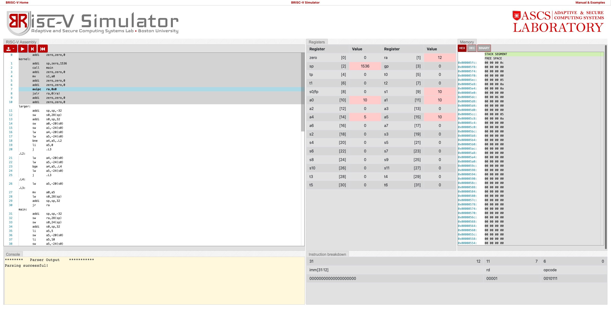

 
<div align='center' ><font size='70'>EECE7352 Homework 2 - Juncen Li</font></div>

# Part A

## 1)


### Question a:

Please see the detail (larger.s) in the directory PartA.


The test result is aligned with our expectations.




### Question b:


The largest number that larger function can accept as input in RISC-V 32-bit Instruction Set Architecture (RV32I) assembly language depends on the instruction encoding and the data type used for the input parameters. In my code, the input parameters are passed using the registers a0 and a1, and it appears that they are stored as 32-bit signed integers, so the largest number that can be passed as an input is 2^31-1 and the smallest number is -2^31.


## 2)


### Question a:


Please see the detail (factorial.s) in the directory PartA.


## 3)


The largest integer value for which I am able to compute the factorial in this program on the RV32I ISA is likely limited by the size of the register that stores the intermediate result (a0) and the maximum value that can be represented by a 32-bit signed integer. On the RV32I ISA, a 32-bit signed integer can represent values in the range [-2^31, 2^31 - 1].

In the program, the factorial of a number 'n' is calculated by multiplying 'n' by (n-1) until I reach the value 1. The intermediate results are stored in register 'a0', which is a 32-bit register. If the intermediate result of the multiplication exceeds the maximum representable value of a 32-bit signed integer, the result will overflow and the computation will produce an incorrect result.

Therefore, the largest integer value for which I can compute the factorial in this program is likely limited to the maximum value that can be represented by a 32-bit signed integer, which is 2^31 - 1, or 2147483647. So, 32-bit fixed point: 12!


# Part B


I can use a profiling tool that keeps track of how many instructions are executed while the program is running to create a dynamic instruction mix table for the quicksort algorithm. 

1. Compile the quicksort program.

```
gcc qsort.c -o qsort
```
2. Write a Pin tool: Pin tool is a dynamic library that implements the instrumentation functions I want to perform on the target program. I can write my own Pin tool to instrument the quicksort program and capture the execution frequency of each basic block. 

3. Compile pin tool

```
make
```

4. Run the Pin tool on the quicksort program: Once the Pin tool is written, I can run it on the quicksort program using the following command:

```
pin -t pintool.so -- qsort
```

4. Analyze the output: The Pin tool will run the quicksort program and produce an output that shows the instruction count for each basic block. This output can then be used to produce a dynamic instruction mix table.


### Dynamic Instruction Mix Table
|Stores     | Loads|Branches|ALU Operations|Jumps|
|-----      |--------     |---     |---     |---     |
|28.2%   |  30.1%    | 12.2%| 25.2%|4.3%|


# Part C


Please look at the PartC directory for the codes' details.

```bash
gcc matrixMultiplication.c -S -std=c99

gcc monteCarloPiEstimation.c -S -std=c99
```

## About matrixMultiplication.s

1. `cvtsi2ss` instruction: This instruction converts an integer to a single-precision floating-point value.

- Operands: A 32-bit or 64-bit integer source operand, in this case `-4(%rbp)` and `-8(%rbp)`.

- Operation: The integer value is converted to a single-precision floating-point value, stored in an XMM register, in this case `%xmm1` and `%xmm0`.


2. `mulss` instruction: This instruction multiplies two single-precision floating-point values.

- Operands: Two single-precision floating-point values stored in XMM registers, in this case `%xmm0` and `%xmm1`.

- Operation: The two operands are multiplied, and the result is stored in one of the XMM register, in this case `%xmm1`.

3. `addss` instruction: This instruction adds two single-precision floating-point values.

- Operands: Two single-precision floating-point values stored in XMM registers, in this case `%xmm0` and `%xmm1`.
- Operation: The two operands are added, and the result is stored in one of the XMM register, in this case `%xmm0`.

4. `movss` instruction: This instruction moves a single-precision floating-point value from one location to another.

- Operands: The source operand is a single-precision floating-point value stored in an XMM register, in this case `%xmm0`; The destination operand is an address that stores the result, in this case `-4000048(%rbp,%rax,4)` and `-8000048(%rbp,%rax,4)`.

- Operation: The single-precision floating-point value is moved from the XMM register to the specified memory location.

## About monteCarloPiEstimation.s


1. `cvtsi2sd` - This instruction converts an integer operand to a double-precision floating-point value. The operands used are the register `%eax` and the destination XMM register `%xmm0`. The operation performed is a conversion of the integer value stored in %eax to a double-precision floating-point value and storing it in `%xmm0`.

2. `mulsd` - This instruction performs a scalar multiplication of two double-precision floating-point operands. The operands used are two XMM registers. The operation performed is to multiply the two operand values and store the result in the first operand register.

3. `divsd` - This instruction performs a scalar division of two double-precision floating-point operands. The operands used are two XMM registers. The operation performed is to divide the first operand value by the second operand value and store the result in the first operand register.

4. `ucomisd` - This instruction performs an unordered comparison of two double-precision floating-point values and sets the status flags in the flag register based on the result of the comparison. The operands used are two XMM registers. The operation performed is to compare the two operand values and set the status flags accordingly.


# Part D

## 1) 

- CISC (Complex Instruction Set Computing) instruction set architectures include:

1. VAX (Virtual Address Extension)
2. x86 (used in many personal computers and servers)

- RISC (Reduced Instruction Set Computing) instruction set architectures include:

1. ARM (Advanced RISC Machines)
2. MIPS (Microprocessor without Interlocked Pipeline Stages)


## 2)

1. Large Instruction Set: The Alpha instruction set has a large number of instructions, making it a CISC-style architecture. This allows for more complex operations to be performed in a single instruction, leading to more efficient code.

2. 64-Bit Architecture: The Alpha instruction set is a 64-bit architecture, which allows for larger memory addressing and increased processing capabilities.

3. Register-Rich: The Alpha instruction set has a large number of general-purpose registers, which allows for efficient register usage and reduces the need for memory access during program execution. This leads to faster performance and improved overall program efficiency.


## 3)

MIPS and PowerPC are both RISC-style instruction set architectures, but they handle conditional branches differently.

Similarities:

- Both MIPS and PowerPC handle conditional branches through a combination of instruction execution and comparison operations.
  
- Both architectures use a compare-and-branch instruction to perform conditional branches, which evaluates a condition and branches to a specified address if the condition is true.

Differences:

- Instruction Format: MIPS uses a dedicated instruction format for conditional branches, while PowerPC uses a more general-purpose instruction format for all branches.
  
- Delay Slots: MIPS uses delay slots, which are extra instruction cycles that must be executed after a branch instruction, regardless of whether the branch is taken or not. PowerPC does not have delay slots.

- Branch Prediction: PowerPC has a more sophisticated branch prediction mechanism than MIPS, which allows it to predict the outcome of a branch and prepare the pipeline accordingly, reducing the impact of branches on performance.
  
In conclusion, while MIPS and PowerPC share similarities in their approach to conditional branches, there are also some key differences in their instruction formats and branch prediction mechanisms that make each architecture unique.


## 4)

The SPARC (Scalable Processor Architecture) ISA uses a feature called "register windows" to improve program performance by reducing the number of memory accesses required for register storage.

Here is an example of how register windows work on the SPARC ISA:

1. The SPARC ISA uses a set of dedicated registers, called "local registers", to store function-local variables and intermediate results.

2. When a function is called, a new set of local registers is created, which is called a "register window". This register window acts as the active set of local registers for the duration of the function call.

3. When a function returns, its register window is discarded, and the previous register window becomes active again. This allows the register windows to be reused, reducing the need for memory accesses to store local variables.

4. If a function requires more local registers than are available in the current register window, a "register window overflow" occurs. This causes a context switch to a new register window, which provides a larger set of local registers.

By using register windows, the SPARC ISA is able to reduce the number of memory accesses required for register storage, improving program performance and reducing the overhead associated with register storage.

## 5)

Based on its impact and widespread use, it could be argued that the fourth generation of the Intel x86 architecture, also known as the 80386, was the most significant advancement from the previous generation of the ISA.

The 80386 introduced several key features that set it apart from its predecessors, including:

1. 32-Bit Architecture: The 80386 was the first x86 architecture to introduce a 32-bit architecture, which allowed for larger memory addressing and increased processing capabilities.

2. Protected Mode: The 80386 introduced protected mode, which allowed for the creation of operating systems that could take advantage of the increased processing capabilities of the architecture.

3. Virtual Memory: The 80386 also introduced virtual memory, which allowed programs to access more memory than was physically available by temporarily transferring data to disk.

These advancements paved the way for the development of modern operating systems and paved the way for the widespread use of personal computers. The 80386 also laid the foundation for the continued evolution of the x86 architecture and its widespread use in personal computers, servers, and other computing devices.


# Part E

## Problem 1.16


### 1)

According to Amdahl's Law, the speedup of an application with N processors is given by the following formula:

Speedup = 1 / ( (1 - P) + (P / N) ),

where P is the fraction of the application that can be parallelized and N is the number of processors.

Given that 80% of the application is parallelizable, the speedup with N processors can be calculated as follows:

Speedup = 1 / ( (1 - 0.8) + (0.8 / N) )
= 1 / ( 0.2 + (0.8 / N) )

Ignoring the cost of communication, the maximum speedup achievable is limited by the fraction of the application that can be parallelized, which in this case is 80%. The exact speedup will depend on the value of N, with the speedup increasing as N increases.


### 2)

In the presence of communication overhead, Amdahl's Law can be modified to take into account the cost of communication. The speedup with N processors in the presence of communication overhead can be calculated as follows:

Speedup = 1 / ( (1 - P) + (P / N) + (C * (N - 1)) / N),

where P is the fraction of the application that can be parallelized, N is the number of processors, and C is the communication overhead as a fraction of the original execution time.

Given that for every processor added, the communication overhead is 0.5% of the original execution time, the speedup with eight processors can be calculated as follows:

Speedup = 1 / ( (1 - P) + (P / 8) + (0.005 * 7) / 8)
= 1 / ( (1 - P) + (P / 8) + 0.004375)
= 1 / ( (1 - 0.8) + (0.8 / 8) + 0.004375)
= 3.27986348

### 3)

Given that for every time the number of processors is doubled, the communication overhead is increased by 0.5% of the original execution time, the speedup with eight processors can be calculated as follows:

Speedup = 1 / ( (1 - P) + (P / 8) + (0.005 * (8 - 1)) / 8)
= 1 / ( (1 - P) + (P / 8) + 0.005)
= 1 / ( (1 - 0.8) + (0.8 / 8) + 0.005)
= 3.275862069

### 4)

Given that for every time the number of processors is doubled, the communication overhead is increased by 0.5% of the original execution time, the speedup with N processors can be calculated as follows:

Speedup = 1 / ( (1 - P) + (P / N) + (0.005 * (N - 1)) / N)
= 1 / ( (1 - P) + (P / N) + 0.005 * log2(N))
= 1 / ( (1 - 0.8) + (0.8 / N) + 0.005 * log2(N))
= 1 / (0.2 + (0.8 / N) + 0.005 * log2(N))

Here, log2(N) is the base-2 logarithm of N, which represents the number of times the number of processors has been doubled to reach N.

### 5)

The general equation to solve for the number of processors with the highest speedup in an application with a specified parallelization fraction (P) and communication overhead (C) can be found by differentiating the expression for speedup with respect to the number of processors (N) and setting it equal to zero.

The expression for speedup with N processors in the presence of communication overhead is given by:

Speedup = 1 / ( (1 - P) + (P / N) + (C * (N - 1)) / N)
= 1 / ( (1 - P) + (P / N) + 0.005 * log2(N))
= 1 / ( (1 - 0.8) + (0.8 / N) + 0.005 * log2(N))
= 1 / (0.2 + (0.8 / N) + 0.005 * log2(N))

Taking the derivative of the expression with respect to N and setting it equal to zero, we obtain:

d(Speedup) / dN = 0
1 / ( (1 - P) + (P / N^2) - (0.005 * P / N) + 0.005 / N) = 0
1 / ( 0.2 + (0.8 / N^2) - (0.004 / N) + 0.005 / N) = 0

Solving for N, we obtain the number of processors with the highest speedup in the presence of communication overhead. However, finding an explicit solution for N requires solving a complex equation and may not be possible in all cases. Numerical methods or approximations can be used to find a numerical solution for N in specific cases.

## Problem A.1

To compute the effective CPI, we need to weigh the average clock cycles of each instruction type by their frequency of occurrence in the code.

Let's assume the frequency of each instruction type is as follows:

Instruction Frequency
All ALU operations f1
Loads f2
Stores f3
Branches
Taken f4
No Taken f5
Jumps f6

The effective CPI is then given by:

Effective CPI = (f1 * 1.0 + f2 * 5.0 + f3 * 3.0 + f4 * 5.0 + f5 * 3.0 + f6 * 3.0) / (f1 + f2 + f3 + f4 + f5 + f6)

If we have the actual frequency information for each instruction type, we can calculate the effective CPI.

## Problem A.7


### a) 

```
  li   t1, 100   # load 100 into register t1
  li   t2, 5000  # load address of C into register t2
  li   t3, 3000  # load address of B into register t3
  li   t4, 1000  # load address of A into register t4
  addi t5, x0, 0 # initialize i to 0

loop:
  ld   t6, 0(t3)  # load B[i] into t6
  add  t7, t6, t2 # t7 = B[i] + C
  sd   t7, 0(t4)  # store t7 into A[i]
  addi t5, t5, 1  # increment i
  addi t3, t3, 8  # increment B pointer by 8
  addi t4, t4, 8  # increment A pointer by 8
  bne  t5, t1, loop # repeat loop if i < 100
```

The number of dynamically executed instructions is 100 * 7 = 700.

The number of memory-data references executed is 100 * 2 = 200.

The code size in bytes is 7 * 4 = 28 bytes, assuming each RISC-V instruction is 4 bytes long.

### b) 

```
  movq $100, %rcx # load 100 into register rcx
  movq $5000, %rdx # load address of C into register rdx
  movq $3000, %rsi # load address of B into register rsi
  movq $1000, %rdi # load address of A into register rdi
  xorq %rax, %rax # initialize i to 0

loop:
  movq (%rsi,%rax,8), %r8 # load B[i] into r8
  addq (%rdx), %r8 # r8 = B[i] + C
  movq %r8, (%rdi,%rax,8) # store r8 into A[i]
  incq %rax # increment i
  cmpq %rcx, %rax # compare i with 100
  jne loop # repeat loop if i < 100
```

The number of dynamically executed instructions is 100 * 7 = 700.

The number of memory-data references executed is 100 * 2 = 200.

The code size in bytes is 7 * 8 = 56 bytes, assuming each x86 instruction is 8 bytes long on average.

### c) 

```
  push 100  # load 100
  push 5000 # load address of C
  push 3000 # load address of B
  push 1000 # load address of A
  push 0    # initialize i to 0

loop:
  push 0(sp)  # load B[i]
  push 0(sp)  # load C
  add         # B[i] + C
  pop 2(sp)   # store result into A[i]
  pop         # discard B[i] + C result
  push 1      # increment i by 1
  add         # i = i + 1
  dup         # duplicate i
  push 100    # compare i with 100
  sub         # i - 100
  jlt loop    # repeat loop if i < 100
  pop         # discard i
  pop         # discard address of A
  pop         # discard address of B
  pop         # discard address of C
  pop         # discard 100
```


The number of dynamically executed instructions is 100 * 10 = 1000.

The number of memory-data references executed is 100 * 3 = 300 because the stack machine uses memory for stack elements beyond the top two.


## Problem A.12

For a 32-bit machine, the size of the foo struct is 1 + 4 + 4 + 8 + 2 + 4 + 8 + 4 + 4 + 4 = 39 bytes.

The minimum size required for this struct is 1 + 4 + 4 + 4 + 2 + 4 + 4 + 4 + 4 + 4 = 32 bytes, achieved by rearranging the order of the members:

```c
struct foo {
    char a;
    int c;
    short e;
    float f; 
    float *fptr;
    double d;
    double g; 
    char *cptr;
    int x;
    bool b;
};
```

For a 64-bit machine, the size of the foo struct is 1 + 4 + 4 + 8 + 2 + 4 + 8 + 8 + 8 + 4 = 48 bytes.

The minimum size required for this struct on a 64-bit machine is 1 + 4 + 4 + 4 + 2 + 4 + 4 + 8 + 8 + 4 = 40 bytes, achieved by rearranging the order of the members:

```c
struct foo {
    char a;
    int c;
    short e;
    float f; 
    float *fptr;
    double d;
    double g; 
    char *cptr;
    bool b;
    int x;
};
```
# Part F

One of the earliest complete computer designs, the IBM 360 architecture was defined in the 1964 paper by Amdahl, Blaauw, and Brooks. It contained a number of innovative features for its day.

The architecture's adaptability with many computer models was among its most striking attributes. The architecture, according to the authors, was created to be compatible with a variety of models, from entry-level to high-end, by having a set of instructions that applied to all models and a feature for backwards compatibility. As a result, software created for one model might be used to run on another without needing to be modified, thus increasing model compatibility. Compared to earlier architectures, which were incompatible between models, this was a considerable improvement.

Numerous data kinds, including integers, floating-point numbers, and character data, were supported by the IBM 360 architecture. For integers and floating-point numbers, the architecture employed a binary representation, and for character data, it used a packed decimal form. In addition to being more effective for some arithmetic operations, the packed decimal representation was utilized to conserve memory.

As contrast, the RISC-V architecture represents all data types, including character data, integers, and floating-point numbers, in binary. The RISC-V architecture can handle single-precision and double-precision floating-point numbers, as well as 8-bit, 16-bit, 32-bit, and 64-bit integers. Additionally, the RISC-V architecture offers a consistent instruction set architecture (ISA) across all implementations, improving program compatibility and portability across many platforms.

In conclusion, the IBM 360 architecture was notable for its flexibility with many computer models and showed a forward-thinking approach to designing computer architecture. It was also novel at the time to employ packed decimal encoding for character data. On the other hand, the RISC-V architecture offers superior software compatibility and portability across various platforms thanks to its consistent ISA and binary representation for all data types.