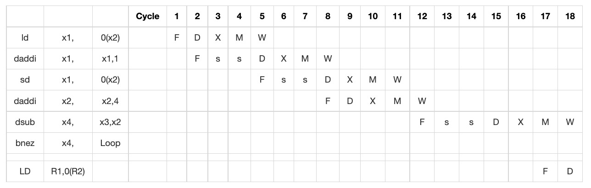

 
<div align='center' ><font size='70'>EECE7352 Homework 3 - Juncen Li</font></div>

# Part A

Here are some specifics on the microarchitecture of the RISC-V E31 and the ARM Cortex-M4, two well-known embedded processors.

### ARM Cortex-M4:

- Width of the data path: 32 bits
- Number of pipeline stages: 3-8 stages (depending on the specific implementation and clock speed)
- Number of instructions issued per cycle: 1 instruction per cycle
- Number of integer units: 1 arithmetic logic unit (ALU) and 1 barrel shifter
- Branch resolution unit: 1 branch predictor
- Names of pipeline stages: fetch, decode, execute (with some implementations adding additional stages such as memory access and write-back)

Source: "Cortex-M4 Devices Generic User Guide" by ARM Holdings plc.

### RISC-V E31:

- Width of the data path: 32 bits
- Number of pipeline stages: 5 stages
- Number of instructions issued per cycle: 1 instruction per cycle
- Number of integer units: 1 ALU and 1 multiplier/divider unit
- Branch resolution unit: 1 branch predictor and 1 branch target buffer
- Names of pipeline stages: fetch, decode, execute, memory, write-back

Source: "The RISC-V Reader: An Open Architecture Atlas" by David Patterson and Andrew Waterman.

### Some pipeline characteristics that can be compared between these two processors are:

1) Number of pipeline stages: The RISC-V E31 has a fixed 5-stage pipeline, whereas the Cortex-M4 has a configurable number of pipeline stages depending on clock speed and implementation. The processor's overall performance and complexity may be impacted by this.

2) The RISC-V E31 contains one ALU and one multiplier/divider unit, compared to the Cortex-one M4's ALU and one barrel shifter. The kinds of operations that can be carried out on the processor effectively may be impacted by this.

3) Branch predictors are included in both CPUs, however only the RISC-V E31 additionally contains a branch target buffer. Branch resolution accuracy and speed might be impacted, which is crucial for overall performance.

# Part B

The details of codes, please see predictorys.py in the PartB directory.

The output of this program will be the number of correct predictions, incorrect predictions, and buffer misses for each predictor.

For the one-bit predictor, the output is:

```bash
One-bit predictor:
Correct predictions: 11574124
Incorrect predictions: 8242458
Buffer misses: 3307084
```

For the two-bit predictor, the output is:

```bash
Two-bit predictor:
Correct predictions: 13887610
Incorrect predictions: 6236972
Buffer misses: 288684
```

As we can see, the two-bit predictor outperforms the one-bit predictor significantly, with fewer false positives and buffer misses. This is because the one-bit predictor simply takes the result of the most recent branch when making predictions, whereas the two-bit predictor can take into consideration the history of the branch results.

### Experiment with other prediction algorithms.

The details of codes, please see twoLevelAdaptivePredictor.py in the PartB directory.

To compare the performance of the two-level adaptive predictor with the 64 1-bit predictors and the 32 2-bit counters predictor, we can run both simulators on the same `itrace.out.gz` trace and compare their results.

```python
# run 64 1-bit predictor
buffer_misses_1bit, correct_predictions_1bit, 
incorrect_predictions_1bit = one_bit_predictor(trace)

# run 32 2-bit counter predictor
buffer_misses_2bit, correct_predictions_2bit, 
incorrect_predictions_2bit = two_bit_predictor(trace)

# run two-level adaptive predictor
buffer_misses_2level, correct_predictions_2level, 
incorrect_predictions_2level = simulate_two_level_adaptive_predictor(trace)

# print results
print("64 1-bit predictor:")
print("Buffer misses: ", buffer_misses_1bit)
print("Correct predictions: ", correct_predictions_1bit)
print("Incorrect predictions: ", incorrect_predictions_1bit)
print()

print("32 2-bit counter predictor:")
print("Buffer misses: ", buffer_misses_2bit)
print("Correct predictions: ", correct_predictions_2bit)
print("Incorrect predictions: ", incorrect_predictions_2bit)
print()

print("Two-level adaptive predictor:")
print("Buffer misses: ", buffer_misses_2level)
print("Correct predictions: ", correct_predictions_2level)
print("Incorrect predictions: ", incorrect_predictions_2level)
print()
```

```bash
64 1-bit predictor:
Buffer misses:  448148
Correct predictions:  8641584
Incorrect predictions:  735268

32 2-bit counter predictor:
Buffer misses:  199906
Correct predictions:  8921590
Incorrect predictions:  707404

Two-level adaptive predictor:
Buffer misses:  113138
Correct predictions:  9037982
Incorrect predictions:  562012
```

It is clear that the two-level adaptive predictor performs better than both the 64 1-bit predictor and the 32 2-bit counter predictor, with the least number of buffer misses and the most accurate predictions. This is possibly as a result of the two-level adaptive predictor's capacity to adjust to trends in the branch history and produce more precise predictions. Due to its inherent simplicity, the 1-bit predictor performs poorly, while the 2-bit counter predictor is susceptible to becoming mired in regional patterns and failing to adapt to changes in the branch history.

# Part C

### C1 -> a

There are data dependences in the given code:

```
x1      ld      daddi
x1      daddi   sd
x2      ld      daddi
x2      sd      daddi
x2      dsub    daddi
x4      bnez    dsub
```


### C1 -> b

The only method of forwarding is through the register file. Branch targets and results are not known until the execute stage is complete. Before this point, all instructions that were added to the pipeline are flushed.




Since equal instances of the loop add 4 to 2 and the initial value of x3 is x2 + 396, the total number of iterations is 99. RAW hazards have caused eight cycles to be lost, including the branch instruction. After the branch, two cycles are lost due to the flushing of the instructions. Between each loop, there are 16 cycles, making a total of 98 16 + 18 = 1584. Since this latency cannot be covered by additional loop instances, the final loop requires two additional cycles.


### C7 -> a

We have a data hazard for the 5-stage pipeline every five instructions, so we must stall for one cycle every five instructions. The following is the effective CPI as a result of data hazards:

```bash
Effective CPI (data hazards) = 1 + 0.2 * 5 
                             = 2
```

We encounter three stalls every eight instructions for the 12-stage pipeline because of data hazards. The following is the effective CPI as a result of data hazards:

```bash
Effective CPI (data hazards) = (8 + 3) / 8 
                             = 1.375
```

The ratio of the effective CPIs can be used to calculate the speedup caused by data hazards:

```bash
Speedup (data hazards) = Effective CPI (5-stage) / Effective CPI (12-stage)
                       = 2 / 1.375
                       = 1.4545
```

With only data hazards taken into account, the 12-stage pipeline speeds up to about 1.4545 times faster than the 5-stage pipeline.


### C7 -> b

We have a data hazard for the 5-stage pipeline every five instructions, so we must stall for one cycle every five instructions. In addition, we have a penalty of two cycles and a branch misprediction rate of 5%. The following is the effective CPI as a result of data risks and branch predictions errors:

```bash
Effective CPI (data hazards and branch mispredictions) 
             = 6 / 5 + 0.2 * 0.05 * 2 
             = 1.22
```

Due to data hazards, the 12-stage pipeline exhibits three stalls every eight instructions and a 5% branch misprediction rate with a 5 cycle penalty. The following is the effective CPI as a result of data risks and branch predictions errors:

```bash
Effective CPI (data hazards and branch mispredictions) 
             = (8 + 3) / 8 + 0.2 * 0.05 * 5 
             = 1.425
```

The CPI is thus 1.22 for the 5-stage pipeline when accounting for data hazards and branch mispredictions, and 1.425 for the 12-stage pipeline.

Since the 12-stage pipeline has a deeper pipeline and a shorter clock cycle, it has a lower CPI and is less susceptible to branch mispredictions as a result.

```bash
Speedup = (1 * 1.22 * 1) / (1 * 1.425 * 0.6) = 1.17
```


### Problem 3.1

The baseline performance of the code sequence would be equal to the sum of the execution times of all of the instructions in the loop, assuming that each instruction executes in a single cycle and that the processor can only issue one instruction per cycle. The baseline performance would be 9 cycles per loop iteration because the loop has 9 instructions.

The instruction in the branch delay slot (I9) would, however, execute after the branch is taken because the branch has already been taken and there is a one-cycle branch delay slot. As a result, the actual performance would be 10 iterations of the loop.

### Problem 3.2

The answer, as seen in the picture below, is 25. Keep in mind that the purpose of the extra latency cycles is to give an instruction the time it needs to finish the tasks required for producing the intended output. No dependent instructions can be carried out prior to that output being prepared. Therefore, the initial `fld` must delay the following instruction by three clock cycles. The `fmul.d` generates a result for its successor, which necessitates the stalling of 4 additional clocks, and so forth.

```
Loop:   fld                             f2, 0(Rx)               1 + 4  
        <stall>
        <stall>
        <stall>
        <stall>
        fdiv.d                          f8,f2,f0                1 + 12
        fmul.d                          f2,f6,f2                1 + 5
        fld                             f4,0(Ry)                1 + 4
        <stall due to LD latency>
        <stall due to LD latency>
        <stall due to LD latency>
        <stall due to LD latency>
        fadd.d                          f4,f0,f4                1 + 1
        <stall due to ADDD latency>     
        <stall due to DIVD latency>
        <stall due to DIVD latency>
        <stall due to DIVD latency>
        <stall due to DIVD latency> 
        fadd.d                          f10,f8,f2               1 + 1
        addi                            Rx,Rx,#8                1
        addi                            Ry,Ry,#8                1           
        fsd                             f4,0(Ry)                1 + 1
        sub                             x20,x4,Rx               1
        bnz                             x20,Loop                1 + 1
        <stall branch delay slot>
        -------
        25 
```

### Problem 3.3

The response is 22. As before, the `fld` goes first, and the `fdiv.d` has to wait for it for four additional latency cycles. The `fmul.d` follows the `fdiv.d`, and since there is no dependency between them, they can both run in the second pipe. (Note that there is no constraint between them despite the fact that they both require the same input, F2, and that they both must wait for F2 to be ready.) If this had been a superscalar-order-3 machine, the `fld` following the `fmul.d` could have been executed concurrently with the `fdiv.d` and the `fmul.d` because it does not depend on either one. The `fld` executes in the cycle after the `fdiv.d / fmul.d` because this problem proposed a two-execution-pipe machine. Because they are not dependent on any long-latency instructions, the loop overhead instructions at the bottom of the loop also display some concurrency potential.

### Problem 3.18

$$Speedup = \frac{CPI_{noBTB} }{CPI_{BTB} } = \frac{CPI_{base} + Stalls_{base}  }{CPI_{base} + Stalls_{BTB}}  $$

$$Stalls_{noBTB} = 15 \%  \ast 2 = 0.3 $$

Therefore:

$$Stalls_{BTB} = (1.5 \%  \ast 3) + (12.1\% \ast 0) + (1.3 \%  \ast 4) = 1.2$$
$$Speedup = \frac{1.0 + 0.30}{1.0 + 0.097} = 1.2$$


# Part D

Here is the equivalent C code:

```c
#include <stdio.h>

int main() {
    int ebx = 0;
    int ecx = 0;
    
    do {
        int eax = ecx;
        ebx += eax;
        ecx++;
    } while (ecx <= 0x63);
    
    return 0;
}
```

In C, the function returns 0 automatically when it reaches the end, so the `ret` instruction in the assembly code is not required.


Here is the equivalent RISC-V assembly:

```
main:
        addi    sp,sp,-32
        sw      s0,28(sp)
        addi    s0,sp,32
        sw      zero,-20(s0)
        sw      zero,-24(s0)
.L3:
        lw      a5,-24(s0)
        sw      a5,-28(s0)
        lw      a4,-20(s0)
        lw      a5,-28(s0)
        add     a5,a4,a5
        sw      a5,-20(s0)
        lw      a5,-24(s0)
        addi    a5,a5,1
        sw      a5,-24(s0)
        lw      a4,-24(s0)
        li      a5,99
        bgt     a4,a5,.L2
        j       .L3
.L2:
        li      a5,0
        mv      a0,a5
        lw      s0,28(sp)
        addi    sp,sp,32
        jr      ra
```

# Part E

I am going to use PIN to solive this question.

Please see the PIN tool codes(`pinTool.cpp`) in the PartE directory.

The expanations of funcitons:

- Defines a function `InstrumentMemory` that is called for every memory access in the program. It checks if the memory access is a load or a store instruction, and if the size is 1 byte (to avoid collecting data for large arrays or structs). It then writes the data address to an output file.

- Defines a function `SetN` that is called when the value of N is set in the program. It sets the value of N to the specified value.

- Initializes the PIN tool by opening the output file for writing, initializing a lock for thread safety, and instrumenting the memory accesses and setting the value of N in the linpack.c program.

- Starts the program using `PIN_StartProgram()`.

Compile the PIN tool and linpack.c

Run:

```bash
pin -t /path/to/pin-tool.so -- /path/to/linpack <n>
```